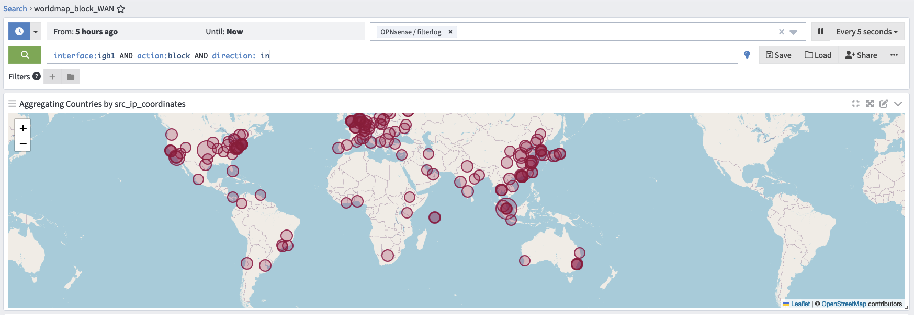

- [Docker](#docker)
- [Configuring InfluxDB](#configuring-influxdb)
- [Configuring Telegraf](#configuring-telegraf)
  * [For previous users](#for-previous-users)
  * [Install the plugin and configure options](#install-the-plugin-and-configure-options)
  * [Alternative OPNSense Configuration via Ansible](#alternative-opnsense-configuration-via-ansible)
  * [Add telegraf to sudoers](#add-telegraf-to-sudoers)
  * [Telegraf Plugins](#telegraf-plugins)
- [Configuring Graylog](#configuring-graylog)
  * [Add GeoIP to Graylog](#add-geoip-to-graylog)
  * [Configure Additional Settings](#configure-additional-settings)
  * [Add Graylog server as syslog target on OPNsense](#add-graylog-server-as-syslog-target-on-opnsense)
- [Configuring Grafana](#configuring-grafana)
  * [Add InfluxDB and ElasticSearch data sources](#add-influxdb-and-elasticsearch-data-sources)
  * [Import Dashboard](#import-dashboard)
  * [Configure Variables](#configure-variables)
- [Configuration for the Suricata dashboard #Optional](#configuration-for-the-suricata-dashboard-optional)
  * [Add the necessary files](#add-the-necessary-files)
  * [Restart Suricata and Telegraf](#restart-suricata-and-telegraf)
  * [Import the Suricata Dashboard](#import-the-suricata-dashboard)
- [Troubleshooting](#troubleshooting)
  * [Telegraf Plugins](#telegraf-plugins-1)
  * [Telegraf Troubleshooting](#telegraf-troubleshooting)
  * [InfluxDB](#influxdb)
  * [View measurements](#view-measurements)
  * [View field values](#view-field-values)
  * [How to drop an InfluxDB v2 measurement](#how-to-drop-an-influxdb-v2-measurement)
  * [Learn more about Flux queries](#learn-more-about-flux-queries)
  * [Suricata Troubleshooting](#suricata-troubleshooting)
  * [Map Issues](#map-issues)

## Docker

To simplify everything, we'll use a Docker Compose file.

You will need to have Docker and Docker Compose installed on a server that will host the dashboard.

[Install Docker](https://docs.docker.com/engine/install/)

[Install Docker Compose](https://docs.docker.com/compose/install/)

After you've installed Docker and Docker Compose, download the docker-compose.yaml from this repo.

`curl https://raw.githubusercontent.com/bsmithio/OPNsense-Dashboard/master/docker-compose.yaml -o docker-compose.yaml`

It's important that you change the TZ environment variable to your timezone for everything to work properly.
I also recommend you change the passwords in this compose file as well.
After you've made the necessary changes, run `docker-compose up -d` in the same directory as your docker-compose.yaml.
Once you have your docker containers running, follow the steps below.

## Configuring InfluxDB
After InfluxDB is started:
1. Go to http://<docker_ip>:8086
2. Setup your username, password, bucket and organization here. 
3. Navigate to Data-->Telegraf and create a configuration for a system. Name it, and copy your API token, you will need this for your Telegraf configuration. 
4. Generate another API token for Grafana. Click on API tokens -> Generate API Token -> Read/Write Access -> Click on your bucket under Read -> and Save. Copy this somewhere as well, you'll need it for Grafana.


## Configuring Telegraf

### For users w/ telegraf installed via freeBSD `pkg`

If you previously used the pkg install version of telegraf, follow these instructions.

Run `sudo pkg remove telegraf` to remove telegraf.

Delete the line that starts with telegraf in /usr/local/etc/sudoers.

Once those are done you can continue with the new configuration.


### Install + configure
Install the Telegraf plugin on OPNsense. `System -> Firmware -> Plugins -> Search` for telegraf, and click the plus icon to install.


Navigate to Services -> Telegraf -> Input

Enable Network and PF Inputs.


Then click Save.

Now navigate to Services -> Telegraf -> Output

Enable Influx v2 Output and fill in the following:

Influx v2 Token: Your InfluxDB Token

Influx v2 URL: Your InfluxDB URL, this will be the IP address or hostname of your system that is running InfluxDB. E.g http://192.168.1.10:8086

Influx v2 Organization: Your InfluxDB Organization

Influx v2 Bucket: Your InfluxDB Bucket


Then click Save.


### Alternative OPNSense Configuration via Ansible

You can use Ansible to automate a few sections. Install [Ansible](https://docs.ansible.com/ansible/latest/installation_guide/installation_distros.html) on your linux server and use the files at https://github.com/bsmithio/OPNsense-Dashboard/tree/master/ansible. If you use this method you can skip these sections: Add telegraf to sudoers, Telegraf Plugins, and Configuration for the Suricata dashboard.

### Add telegraf to sudoers

After that, we need to add telegraf to sudoers and use nopasswd to restrict telegraf to only what it needs to run as root.

```
printf 'telegraf ALL=(root) NOPASSWD: /usr/local/bin/telegraf_pfifgw.php\n' | sudo tee -a /usr/local/etc/sudoers > /dev/null
```

You may also wish to disable sudo logging for telegraf_pfifgw.php, otherwise you'll see many sudo logs from telegraf running the script every 10 seconds.

```
printf 'Cmnd_Alias PFIFGW = /usr/local/bin/telegraf_pfifgw.php\n' | sudo tee -a /usr/local/etc/sudoers > /dev/null
printf 'Defaults!PFIFGW !log_allowed\n' | sudo tee -a /usr/local/etc/sudoers > /dev/null
```

Add the  [custom.conf](./config/custom.conf) telegraf config to /usr/local/etc/telegraf.d

```
sudo mkdir /usr/local/etc/telegraf.d
sudo chown telegraf:telegraf /usr/local/etc/telegraf.d
sudo chmod 750 /usr/local/etc/telegraf.d
sudo curl https://raw.githubusercontent.com/bsmithio/OPNsense-Dashboard/master/config/custom.conf -o /usr/local/etc/telegraf.d/custom.conf
```

### Telegraf Plugins

**Plugins must be copied to your OPNsense system**

Place [telegraf_pfifgw.php](https://raw.githubusercontent.com/bsmithio/OPNsense-Dashboard/master/plugins/telegraf_pfifgw.php) and [telegraf_temperature.sh](https://raw.githubusercontent.com/bsmithio/OPNsense-Dashboard/master/plugins/telegraf_temperature.sh) in /usr/local/bin and chmod them to 755.

```
curl "https://raw.githubusercontent.com/bsmithio/OPNsense-Dashboard/master/plugins/telegraf_pfifgw.php" -o /usr/local/bin/telegraf_pfifgw.php
curl "https://raw.githubusercontent.com/bsmithio/OPNsense-Dashboard/master/plugins/telegraf_temperature.sh" -o /usr/local/bin/telegraf_temperature.sh
chmod 755 /usr/local/bin/telegraf_temperature.sh /usr/local/bin/telegraf_pfifgw.php
```

Test these out before starting the telegraf service by executing them

`sudo telegraf_pfifgw.php`

`telegraf_temperature.sh`

The temperature plugin may not work on every system, if you receive `sysctl: unknown oid 'hw.acpi.thermal'` comment out or remove that line from the plugin.

After this is done, navigate to Services -> Telegraf -> General -> Enable Telegraf Agent.

Lastly, check if Telegraf is running

`sudo service telegraf status`

## Configuring Graylog

### 1. Add GeoIP to Graylog

To make the map work on Grafana, you must create a MaxMind account here https://www.maxmind.com/en/geolite2/signup. Then generate a license key by going to Account -> Manage License Keys -> Generate New License Key. Copy this key somewhere because you'll need it again soon.

Three GeoIP files are useful: _Country_, _City_, and _ASN_ database. _Note: Due to recent changes by Maxmind, City database does not give the same information as Country. Additional information about GeoIP can be found [below](#geoip-graylog-info)

You'll need to download the GeoIP database file to your local machine Graylog container. Access your Graylog container's shell from your Docker host like so:

    sudo docker exec -it graylog /bin/bash

Then download the database file, replace `YOUR_LICENSE` with the key you generated above.

  ```
  curl -flLs "https://download.maxmind.com/app/geoip_download?edition_id=GeoLite2-Country&license_key=<YOUR_LICENSE>>&suffix=tar.gz" -o GeoLite2-Country.tar.gz \
  && tar -xzvf GeoLite2-Country.tar.gz \
  && mv GeoLite2-Country_*/GeoLite2-Country.mmdb /usr/share/graylog/data/data/

  curl -flLs "https://download.maxmind.com/app/geoip_download?edition_id=GeoLite2-City&license_key=<YOUR_LICENSE>&suffix=tar.gz" -o GeoLite2-City.tar.gz \
  && tar -xzvf GeoLite2-City.tar.gz \
  && mv GeoLite2-City_*/GeoLite2-City.mmdb /usr/share/graylog/data/data/

  curl -flLs "https://download.maxmind.com/app/geoip_download?edition_id=GeoLite2-City&license_key=<YOUR_LICENSE>&suffix=tar.gz" -o GeoLite2-ASN.tar.gz \
  && tar -xzvf GeoLite2-ASN.tar.gz \
  && mv GeoLite2-ASN_*/GeoLite2-ASN.mmdb /usr/share/graylog/data/data/
  ```

### 2. Install Content Pack

1. In a browser login in at http://<docker-ip>:9000.
2. For Graylog, it's recommended to create an index set. To do so, navigate to System -> Indices. Create an index set with the name "OPNsense / filterlog" and set the index prefix to `opnsense_filterlog`.

    

3. Download [content pack](https://raw.githubusercontent.com/morikplay/OPNsense-Dashboard/master/config/OPNsense-GraylogContent-Pack.json).

4. Install content pack on Graylog: `System -> Content Packs -> Upload`, choose the pack, `Upload`, then `Install`. Two configurables are provided in the `Content Pack`.

    a. `Port` for receiving `filterlog`

    b. `Name` of the syslog input


5. `Content Pack` should install the following components:
- `input`
- `stream`
- `grok extractors` _only v4 extractors are provided as I do not yet have v6 enabled_
  - &check; IPv4 UDP
  - &check; IPv4 TCP
  - &check; IPv4 ICMP
  - &cross; IPv4 UDP
  - &cross; IPv4 TCP
  - &cross; IPv4 ICMP
- `pipeline` along with `rules`
- `lookup table`
- `cache`
- `data adapter`
- `search` with geomap display
  

### 3. Fine-tuning
1. Add index set from [2] earlier to `OPNsense / filterlog` stream. Navigate to `Streams -> More Actions -> Edit Stream` -> select your index set and save.
    

2. Navigate to `System -> Configurations -> Message Processors`. The following order worked for [Brian Smith](https://github.com/bsmithio):

      

But, I had to switch `GeoIP Resolver` and `Pipeline Processor`

Ensure that all of these are enabled, and click save.

### 4. Add Graylog server as syslog target on OPNsense

Once that is all done, login to your OPNsense router and navigate to System -> Settings -> Logging / targets. Add a new target with the following options:


Add a description if you'd like, then click save.

_Note: I use port `1514` for sending standard `syslog` UDP streams from many of my VMs/containers. So as to reduce clutter and processing overhead, I changed this port to `1515`. This enables the `OPNSense / filterlog` regex + extractors to work only on `filterlog` messages from OPNSense; not regular syslogs from other entities._

## Configuring Grafana

### Add InfluxDB and ElasticSearch data sources

You will need to add the data sources on Grafana. Navigate to http://<docker_ip>:3000, login and click on the cog wheel and Add a Data Source.

For InfluxDB, make the following configurations

Query Language: Flux

URL: http://influxdb:8086

Organization: Your InfluxDB Organization

Token: Your Grafana InfluxDB API Token

Default Bucket: Your opnsense bucket. This will be the bucket that the panel queries will use.

  

For ElasticSearch, make the following configurations

URL: http://elasticsearch:9200

Time field name: timestamp

Version: 7.10+


### Import Dashboard

To import the dashboard, copy the JSON from [OPNsense-Grafana-Dashboard.json](https://raw.githubusercontent.com/morikplay/OPNsense-Dashboard/master/grafana/OPNsense-Grafana-Dashboard.json)
Navigate to `Dashboards -> Browse -> Import`, paste under Import via panel json.

### Configure Variables

Dashboard Settings -> Variables -> Click on a variable to edit

- WAN - It is currently set to igb1 under Custom options. Use a comma-separated list for multiple WAN interfaces by editing the `Custom options` field.

- LAN - $LAN uses a regex to remove any interfaces you don't want to be grouped as LAN. The filtering happens in the "Regex" field. I use a negative lookahead regex to match the interfaces I want excluded.  It should be pretty easy to understand what you need to do here. I have excluded `igb1` (WAN). My traffic is on a `lagg0` interface not `igb0` therefore i have excluded `igb0` as well. 
  ```
  /^(?!enc0$|igb0$|igb1$)/
  ```

- iface - $iface is the interface variable for the Firewall panels. Its value is populated using flux query.

Recommended time range should be less than 24 hours. 

## Configuration for the Suricata dashboard #Optional
__(NOT YET TESTED for new `filterlog` format)__

This section assumes you have already configured Suricata.

### Add the necessary files

Add [suricata.conf](./config/suricata/suricata.conf) to /usr/local/etc/telegraf.d

```
sudo curl 'https://raw.githubusercontent.com/bsmithio/OPNsense-Dashboard/master/config/suricata/suricata.conf' -o /usr/local/etc/telegraf.d/suricata.conf
```

Add [custom.yaml](./config/suricata/custom.yaml) to /usr/local/opnsense/service/templates/OPNsense/IDS

```
sudo curl 'https://raw.githubusercontent.com/bsmithio/OPNsense-Dashboard/master/config/suricata/custom.yaml' -o /usr/local/opnsense/service/templates/OPNsense/IDS/custom.yaml
```

Create the log file and give telegraf permissions to read it

```
sudo touch /tmp/eve.json
sudo chown :telegraf /tmp/eve.json
sudo chmod 640 /tmp/eve.json
```

### Restart Suricata and Telegraf

Restart Suricata from Services -> Intrusion Detection -> Administration

Uncheck Enabled and click Apply.

Check Enabled and click Apply.

Restart telegraf by running

`sudo service telegraf restart`

### Import the Suricata Dashboard

To import the dashboard, copy the JSON from [OPNsense-Grafana-Dashboard-Suricata.json](https://raw.githubusercontent.com/bsmithio/OPNsense-Dashboard/master/OPNsense-Grafana-Dashboard-Suricata.json) and navigate to Dashboards -> Browse -> Import and paste under Import via panel json.

## Troubleshooting

### Telegraf Plugins

- You can run most plugins from a shell/ssh session to verify the output. (the environment vars may be different when telegraf is executing the plugin)
- If you're copying from a windows system, make sure the [CRLF is correct](https://www.cyberciti.biz/faq/howto-unix-linux-convert-dos-newlines-cr-lf-unix-text-format/)
- The below command should display unix line endings (\n or LF) as $ and Windows line endings (\r\n or CRLF) as ^M$.

`cat -e /usr/local/bin/telegraf_pfifgw.php`

### Telegraf Troubleshooting
If you get no good output from running the plugin directly, try the following command before moving to the step below.

`sudo su -m telegraf -c 'telegraf --test --config /usr/local/etc/telegraf.conf --config-directory /usr/local/etc/telegraf.d'`

To troubleshoot plugins further, enable Debug Log and disable Quiet Log in the Telegraf GUI then click Save. Run the above command again.

`sudo su -m telegraf -c 'telegraf --test --config /usr/local/etc/telegraf.conf --config-directory /usr/local/etc/telegraf.d'`


### InfluxDB
When in doubt, run a few queries to see if the data you are looking for is being populated.
I recommend doing this in Grafana's Explore tab.

### View measurements
    import "influxdata/influxdb/schema"

    schema.measurements(bucket: "opnsense")

### View field values

    from(bucket: "opnsense")
      |> range(start: -24h)
      |> filter(fn: (r) => r["_measurement"] == "system")
      |> limit(n:10)

### How to drop an InfluxDB v2 measurement

You must access your InfluxDB instance's shell to do this.

To do so run

`sudo docker exec -it influxdb /bin/bash`

on your docker host.

Then use the following

```
influx delete --bucket "$YourBucket" --predicate '_measurement="$Example"' -o $organization --start "1970-01-01T00:00:00Z" --stop "2050-12-31T23:59:00Z" --token "$YourAPIToken"
```

### Learn more about Flux queries

https://docs.influxdata.com/influxdb/cloud/query-data/flux/query-fields/

https://docs.influxdata.com/influxdb/cloud/query-data/flux/explore-schema/

### Suricata Troubleshooting

If there is no data on the Suricata dashboard, verify if there are any alerts in /tmp/eve.json.

If there is nothing in /tmp/eve.json, verify that /usr/local/opnsense/service/templates/OPNsense/IDS/custom.yaml and /usr/local/etc/suricata/custom.yaml are identical to the one in this repo.

If /usr/local/etc/suricata/custom.yaml is not identical, but /usr/local/opnsense/service/templates/OPNsense/IDS/custom.yaml is, you will need to reload Suricata from the GUI. To do so you would uncheck Enable in the Suricata GUI, click Apply, then check Enable, and click Apply again. You will need to wait for Suricata to reload. If you have a lot of rules this can take some time. 

If you've verified and done all the steps above, and still see nothing, you could try using [tmNIDS](https://github.com/3CORESec/testmynids.org) to generate alerts. You will need bash installed on your OPNsense system for this. 

`sudo pkg install bash`

Once you have bash installed, you can use this one-liner to download and execute tmNIDS.

```
curl https://raw.githubusercontent.com/3CORESec/testmynids.org/master/tmNIDS -o /tmp/tmNIDS && chmod +x /tmp/tmNIDS && bash /tmp/tmNIDS
```

You can then run the tests through the CLI.


### GeoIP graylog info
Graylog GeoIP plugin gives the following lookup information (_Assuming MaxMind database is made available_)
#### ASN Database
```
{
    "as_number": 15169,
    "as_organization": "Google LLC"
}
```
#### Country Database
```
{
    "continent": { "code": "NA", "geoname_id": 6255149, "names": { "en": "North America" } },
    "country": { "geoname_id": 6252001, "iso_code": "US", "names": { "en": "United States" } },
    "registered_country": { "geoname_id": 6252001, "iso_code": "US", "names": { } },
    "represented_country": { "geoname_id": null, "iso_code": "US", "names": { } },
    "traits": {
      "ip_address": "8.8.8.8",
      "is_anonymous_proxy": false,
      "is_legitimate_proxy": false,
      "is_satellite_provider": false,
      "isp": null,
      "organization": null,
    }
}
```
#### City Database
```
{
    "city": { "geoname_id": 5375480, "names": { "en": "Mountain View" } },
    "location": {
      "accuracy_radius": 1000,
      "average_income": null,
      "latitude": 37.386,
      "longitude": -122.0838,
      "metro_code": 807,
      "population_density": null,
      "time_zone": "America/Los_Angeles"
    },
    "postal": { "code": "94035" },
    "subdivisions": [ { "geoname_id": 5332921, "iso_code": "CA", "names": { "en": "California" } } ],
}
```